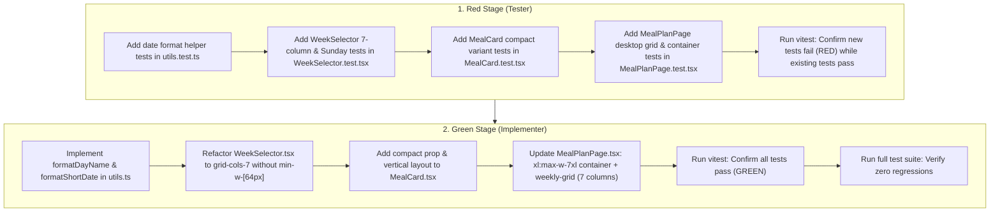

# Implementation Plan: NUT-68 Desktop Meal Plan & Stitch Alignment

- **Generation Timestamp**: 2026-09-30T10:18:30-03:00
- **Reference Design**: [.plans/nut-68-desktop-meal-plan/design.md](file:///C:/Users/Usuario/Documents/projects/nutria-lab-II/.plans/nut-68-desktop-meal-plan/design.md)
- **Status**: Proposed

---

## 1. Concrete Files & Symbols

### 1.1 Modified Files

1. [`apps/web/src/modules/meal-plan/components/WeekSelector.tsx`](file:///C:/Users/Usuario/Documents/projects/nutria-lab-II/apps/web/src/modules/meal-plan/components/WeekSelector.tsx)
   - **Component**: `WeekSelector({ days, selectedDate, onSelectDate }: WeekSelectorProps)`
   - **Current issue**: Container has `flex gap-3 overflow-x-auto pb-2 [scrollbar-width:none] [&::-webkit-scrollbar]:hidden` and tab buttons have `min-w-[64px] shrink-0`. In a 480px usable mobile container on desktop, 7 × 64px + 6 × 12px = 520px > 480px, causing Sunday (Dom) to be pushed outside the container and clipped.
   - **Changes**:
     - Replace rigid flex container with a 7-column CSS Grid: `grid grid-cols-7 gap-1 sm:gap-2 w-full pb-2`.
     - Remove `min-w-[64px]` and `shrink-0` from the button styling, using `w-full h-20 flex flex-col items-center justify-center gap-1 rounded-xl py-2 text-xs transition-colors`.
     - Preserve roving `tabIndex`, `role="tablist"`, `role="tab"`, keyboard arrow navigation (`ArrowLeft`, `ArrowRight` with cyclic wrap-around), and ARIA attributes (`aria-selected`).

2. [`apps/web/src/modules/meal-plan/pages/MealPlanPage.tsx`](file:///C:/Users/Usuario/Documents/projects/nutria-lab-II/apps/web/src/modules/meal-plan/pages/MealPlanPage.tsx)
   - **Components**: `MealPlanPage()`, `LoadingSkeleton()`
   - **Current issue**: Main wrapper and skeleton have hardcoded `max-w-lg` (`mx-auto max-w-lg space-y-6 px-4 py-6`), locking the desktop view into a narrow 512px strip and preventing full-week desktop layouts.
   - **Changes**:
     - Container breakout: Replace `max-w-lg` on `<main>` and `LoadingSkeleton` with responsive max-width: `w-full max-w-lg xl:max-w-7xl mx-auto space-y-6 px-4 sm:px-6 lg:px-8 py-6`.
     - Dual Adaptive Layout:
       - **Compact / Mobile View (`xl:hidden space-y-6`)**: Renders `WeekSelector`, single day heading (`formatFullDate(selectedDate)`), and single-day vertical stack of `MealCard`s for `selectedDay`.
       - **Desktop 7-Day Grid View (`hidden xl:grid xl:grid-cols-7 gap-4 items-start`, testid `"weekly-grid"`)**: Renders all 7 days side-by-side:
         - 7 Day Columns (`data-testid="day-column"`), one for each day from Monday to Sunday.
         - Day Column Header: Day name in Literata (`font-headline text-base font-bold text-on-surface`), date badge (`text-xs font-semibold tracking-wider text-secondary uppercase`), and active/today indicator line (`border-b-2 border-brand-green`).
         - Meals Stack: List of `day.meals` rendered via `MealCard` with `compact={true}`.

3. [`apps/web/src/modules/meal-plan/components/MealCard.tsx`](file:///C:/Users/Usuario/Documents/projects/nutria-lab-II/apps/web/src/modules/meal-plan/components/MealCard.tsx)
   - **Component**: `MealCard({ meal, compact }: MealCardProps)`
   - **Props**: Add optional `compact?: boolean` (defaults to `false` to preserve 100% backward compatibility for all existing tests and mobile usage).
   - **Changes**:
     - When `compact={true}` (desktop 7-column grid): Renders vertical card layout:
       - Top row: `MealTypeBadge` (tertiary amber badge `text-tertiary bg-tertiary-fixed/40`) + Quick-swap trigger button (`material-symbols-outlined` with `sync` icon, `aria-label="Cambiar comida"`).
       - Recipe thumbnail: `h-24 w-full object-cover rounded-lg bg-surface-container` (or image placeholder).
       - Recipe title: `font-headline text-xs font-bold leading-snug line-clamp-2 text-on-surface`.
       - Metadata row: prep time (`schedule` icon + min) and calories (`local_fire_department` icon + kcal).
     - When `compact={false}` (default): Keeps existing horizontal card layout with expandable ingredients/instructions accordion.

4. [`apps/web/src/modules/meal-plan/utils.ts`](file:///C:/Users/Usuario/Documents/projects/nutria-lab-II/apps/web/src/modules/meal-plan/utils.ts)
   - **New Helper Symbols**:
     - `formatDayName(dateStr: string): string`: Returns full day name capitalized (e.g. `'Lunes'`, `'Martes'`, ..., `'Domingo'`).
     - `formatShortDate(dateStr: string): string`: Returns short date badge (e.g. `'12 MAY'`, `'24 AGO'`).
   - Existing helpers (`formatDayAbbreviation`, `formatDayNumber`, `formatFullDate`, `formatWeekRange`, `parseLocalDate`, `formatLocalDateKey`) remain intact.

### 1.2 Test Files to Update

1. [`apps/web/src/modules/meal-plan/components/WeekSelector.test.tsx`](file:///C:/Users/Usuario/Documents/projects/nutria-lab-II/apps/web/src/modules/meal-plan/components/WeekSelector.test.tsx)
   - Add tests verifying fluid 7-column grid layout, zero `min-w-[64px]` clipping, Sunday tab presence, Sunday selection via click, and cyclic keyboard navigation across all 7 days.

2. [`apps/web/src/modules/meal-plan/pages/MealPlanPage.test.tsx`](file:///C:/Users/Usuario/Documents/projects/nutria-lab-II/apps/web/src/modules/meal-plan/pages/MealPlanPage.test.tsx)
   - Add integration tests verifying container breakout (`xl:max-w-7xl`), desktop 7-day grid rendering (`data-testid="weekly-grid"`), 7 day columns (`data-testid="day-column"`), Sunday presence as 7th column with Sunday meals, and desktop meal card slots.

3. [`apps/web/src/modules/meal-plan/components/MealCard.test.tsx`](file:///C:/Users/Usuario/Documents/projects/nutria-lab-II/apps/web/src/modules/meal-plan/components/MealCard.test.tsx)
   - Add tests verifying `compact` card variant layout (category badge, swap button, title, metadata pills, fallback when recipe is null).

4. [`apps/web/src/modules/meal-plan/utils.test.ts`](file:///C:/Users/Usuario/Documents/projects/nutria-lab-II/apps/web/src/modules/meal-plan/utils.test.ts)
   - Add tests verifying `formatDayName` and `formatShortDate` against both ISO datetime and YYYY-MM-DD inputs.

---

## 2. Implementation Steps



### 2.1 Tester Steps (Red Stage)

1. **Step T1 — Utils Date Formatting Tests (`utils.test.ts`)**:
   - `describe('formatDayName')`: Verify returns `'Lunes'` for `2026-08-24`, `'Domingo'` for `2026-08-30`, and handles ISO datetime strings (`'2026-08-30T00:00:00.000Z'`).
   - `describe('formatShortDate')`: Verify returns `'24 AGO'` for `2026-08-24`, `'30 AGO'` for `2026-08-30`.

2. **Step T2 — WeekSelector Fluid Distribution & Sunday Reachability (`WeekSelector.test.tsx`)**:
   - Create a 7-day fixture: Monday (`2026-08-24`) through Sunday (`2026-08-30`).
   - Test: `renders all 7 days with a fluid grid-cols-7 layout without rigid min-w-[64px] buttons`:
     - Render `WeekSelector` with 7 days.
     - Expect `role="tablist"` element to have `grid-cols-7` and `w-full` class.
     - Expect all 7 buttons to NOT contain `min-w-[64px]` and NOT contain `shrink-0`.
   - Test: `renders Sunday (Dom) tab and selects Sunday on click`:
     - Expect Sunday tab `screen.getByRole('tab', { name: /dom|30/i })` to be in the document.
     - Simulate click on Sunday tab.
     - Assert `onSelectDate` called with `'2026-08-30'`.
   - Test: `navigates to Sunday via keyboard navigation from Saturday`:
     - Focus Saturday tab (`name: /29/`).
     - Trigger `{ArrowRight}`.
     - Assert `onSelectDate` called with `'2026-08-30'`.

3. **Step T3 — MealCard Compact Grid Variant (`MealCard.test.tsx`)**:
   - Test: `renders compact card layout with category badge, swap button, and title when compact=true`:
     - Render `<MealCard meal={buildMeal()} compact />`.
     - Expect recipe title `'Avena con frutos rojos'` in document.
     - Expect category badge `'Desayuno'` or `'DESAYUNO'` in document.
     - Expect quick-swap action button with accessible name `screen.getByRole('button', { name: /cambiar|swap/i })`.
   - Test: `shows fallback in compact mode when recipe is null`:
     - Render `<MealCard meal={buildMeal({ recipe: null, recipeId: null })} compact />`.
     - Expect `'Receta no disponible'` in document.

4. **Step T4 — MealPlanPage Desktop Grid & Container Breakout (`MealPlanPage.test.tsx`)**:
   - Setup a 7-day fixture (`REAL_7_DAY_MEAL_PLAN`) covering Monday (`2026-08-24`) to Sunday (`2026-08-30`), where Sunday includes a meal (`title: 'Cena de domingo'`).
   - Test: `unshackles desktop container from rigid max-w-lg`:
     - Render `MealPlanPage`.
     - Assert `<main>` element includes `xl:max-w-7xl` (not exclusively `max-w-lg`).
   - Test: `renders 7-day weekly grid on desktop`:
     - Assert `screen.getByTestId('weekly-grid')` is present in DOM.
     - Assert `screen.getAllByTestId('day-column')` has exactly 7 elements.
   - Test: `renders Sunday in the 7th column with Sunday planned meals`:
     - Check 7th column (`columns[6]`): contains day title `'Domingo'` and date badge `'30 AGO'`.
     - Verify Sunday meal `'Cena de domingo'` is rendered inside the Sunday column.

5. **Step T5 — Verify RED State**:
   - Run `npx vitest run src/modules/meal-plan`.
   - Verify new tests fail as expected (classes/elements not present yet) while existing tests continue passing.

### 2.2 Implementer Steps (Green Stage)

1. **Step I1 — Implement Helpers in `utils.ts`**:
   - Add `formatDayName(dateStr: string): string` using `parseLocalDate(dateStr)` and `WEEKDAY_NAMES`.
   - Add `formatShortDate(dateStr: string): string` using `parseLocalDate(dateStr)` and uppercase Spanish month abbreviations.

2. **Step I2 — Refactor `WeekSelector.tsx`**:
   - Change container classes:
     ```tsx
     <div
       className="grid grid-cols-7 gap-1 sm:gap-2 w-full pb-2"
       role="tablist"
       aria-label="Días de la semana"
     >
     ```
   - Change tab button classes:
     ```tsx
     className={`flex w-full h-20 flex-col items-center justify-center gap-1 rounded-xl py-2 text-xs transition-colors focus-visible:outline focus-visible:outline-2 focus-visible:outline-offset-2 focus-visible:outline-brand-green ${
       isSelected
         ? 'bg-primary-container font-bold text-on-primary-fixed shadow-sm'
         : 'bg-surface-container font-medium text-on-surface-variant hover:bg-surface-container-high'
     }`}
     ```

3. **Step I3 — Enhance `MealCard.tsx` with Compact Mode**:
   - Update `MealCardProps`: `type MealCardProps = { meal: Meal; compact?: boolean; onSwap?: (meal: Meal) => void; };`.
   - If `compact` is `true`, render vertical layout:
     ```tsx
     <article className="flex flex-col gap-2 rounded-xl bg-white p-2.5 shadow-sm border border-outline-variant/30 hover:border-brand-green/30 transition-all">
       <div className="flex items-center justify-between">
         <MealTypeBadge mealType={meal.mealType} />
         <button
           type="button"
           aria-label={`Cambiar comida ${recipe?.title ?? ''}`}
           onClick={() => onSwap?.(meal)}
           className="flex h-7 w-7 items-center justify-center rounded-lg text-on-surface-variant hover:bg-surface-container hover:text-brand-green transition-colors"
         >
           <span className="material-symbols-outlined text-sm">sync</span>
         </button>
       </div>
       <div className="h-20 w-full overflow-hidden rounded-lg bg-surface-container">
         {/* Image thumbnail placeholder */}
       </div>
       <h4 className="font-headline text-xs font-bold leading-tight line-clamp-2 text-on-surface">
         {recipe ? recipe.title : 'Receta no disponible'}
       </h4>
       {recipe && (
         <div className="mt-auto flex items-center gap-2 text-[10px] font-semibold text-on-surface-variant">
           {totalMinutes != null && (
             <span className="flex items-center gap-0.5">
               <span className="material-symbols-outlined text-xs">schedule</span>
               {totalMinutes}m
             </span>
           )}
           {calories != null && (
             <span className="flex items-center gap-0.5 text-brand-green">
               <span className="material-symbols-outlined text-xs">local_fire_department</span>
               {calories} kcal
             </span>
           )}
         </div>
       )}
     </article>
     ```

4. **Step I4 — Update `MealPlanPage.tsx` Layout & Desktop Grid**:
   - Update `<main>` element:
     ```tsx
     <main className="w-full max-w-lg xl:max-w-7xl mx-auto space-y-6 px-4 sm:px-6 lg:px-8 py-6">
     ```
   - Update `LoadingSkeleton`:
     ```tsx
     <div className="w-full max-w-lg xl:max-w-7xl mx-auto animate-pulse space-y-6 px-4 sm:px-6 lg:px-8 py-6" ...>
     ```
   - Under header and banner, add the dual responsive structure:
     ```tsx
     {/* Mobile / Compact view (<1280px) */}
     <div className="xl:hidden space-y-6">
       <WeekSelector days={mealPlan.days} selectedDate={selectedDate} onSelectDate={handleSelectDate} />
       <h2 className="font-headline text-lg font-semibold text-on-surface">
         {formatFullDate(selectedDate)}
       </h2>
       <div className="space-y-4">
         {selectedDay?.meals.map((meal, index) => (
           <MealCard key={`${meal.mealType}-${index}`} meal={meal} />
         ))}
       </div>
     </div>

     {/* Desktop 7-Day Grid View (>=1280px) */}
     <div data-testid="weekly-grid" className="hidden xl:grid xl:grid-cols-7 gap-4 items-start">
       {mealPlan.days.map((day) => {
         const isToday = day.date === defaultDate;
         return (
           <div
             key={day.date}
             data-testid="day-column"
             className="flex flex-col gap-3 rounded-2xl bg-surface-container-low/50 p-3 border border-outline-variant/30 min-h-[480px]"
           >
             <div className={`pb-2 border-b-2 ${isToday ? 'border-brand-green' : 'border-outline-variant/40'}`}>
               <h3 className="font-headline text-sm font-bold text-on-surface">
                 {formatDayName(day.date)}
               </h3>
               <span className="text-[11px] font-semibold tracking-wider text-secondary uppercase">
                 {formatShortDate(day.date)}
               </span>
             </div>
             <div className="flex flex-col gap-2.5">
               {day.meals.map((meal, idx) => (
                 <MealCard key={`${meal.mealType}-${idx}`} meal={meal} compact />
               ))}
               {day.meals.length === 0 && (
                 <p className="py-6 text-center text-xs text-on-surface-variant">Sin comidas</p>
               )}
             </div>
           </div>
         );
       })}
     </div>
     ```

5. **Step I5 — Run vitest & Verify GREEN**:
   - `npx vitest run src/modules/meal-plan` -> all tests pass.
   - Run full suite: `npx vitest run` -> 0 regressions across all 39 test suites.

---

## 3. Component Specifics & CSS Classes

### 3.1 Responsive Breakpoints & Width Constraints

| Breakpoint | CSS Utility Class | Container Max-Width | Layout Presentation |
|---|---|---|---|
| **Mobile (`<768px`)** | Default | `max-w-lg` (512px) | Single-day vertical stack with fluid 7-day selector |
| **Tablet (`768px - 1023px`)** | `md:` | `max-w-lg` or fluid | Single-day stack with fluid 7-day selector |
| **Desktop Laptop (`1024px - 1279px`)** | `lg:` | `max-w-lg` / fluid | Single-day stack or 7-day selector spanning container |
| **Desktop Ultra / Wide (`>= 1280px`)** | `xl:` | `xl:max-w-7xl` (~1280px) | Full 7-column weekly grid (`xl:grid xl:grid-cols-7`) |

### 3.2 WeekSelector Grid & Sunday Zero-Clipping

- **Container Classes**:
  `className="grid grid-cols-7 gap-1 sm:gap-2 w-full pb-2"`
- **Why this eliminates Sunday clipping**:
  - The container is no longer a flex row with rigid minimum width (`min-w-[64px]` × 7 = 448px + 72px gaps = 520px).
  - CSS Grid with `grid-cols-7 w-full` allocates 7 equal fractional columns (`1fr` each) regardless of viewport width.
  - On a 360px mobile screen (328px usable width after 16px padding on each side): `(328px - 6 * 4px) / 7 ≈ 43.4px` per day button.
  - Buttons use `w-full` with vertical centering (`flex w-full h-20 flex-col items-center justify-center py-2 text-xs`).
  - Text scales cleanly: abbreviation uses `text-[10px] uppercase tracking-wide`, day number uses `text-xl font-bold`.
  - Sunday (Dom) is strictly situated in column 7, inside the container boundary, completely visible and clickable.

### 3.3 Container Unshackling on Desktop

- **Old Container**:
  `className="mx-auto max-w-lg space-y-6 px-4 py-6"` (restricted to 512px on all screens).
- **New Container**:
  `className="w-full max-w-lg xl:max-w-7xl mx-auto space-y-6 px-4 sm:px-6 lg:px-8 py-6"`
- **Interaction with Sidebar**:
  - In `AppLayout.tsx`, the `Sidebar` is a flex item (`hidden w-60 shrink-0 flex-col ... md:flex`).
  - The main workspace is wrapped in `<div className="flex min-w-0 flex-1 flex-col">`.
  - Therefore, `MealPlanPage`'s container expands naturally within the remaining flex width without needing manual `ml-64` offsets.
  - At `>=1280px` (`xl:`), `xl:max-w-7xl` gives ~1280px of workspace, allowing 7 columns of ~160px width each with `gap-4`.

### 3.4 Google Stitch & Terra Design Alignment

| Element | Terra Design Token / CSS Class | Purpose |
|---|---|---|
| **Page Background** | `bg-brand-cream` (`#faf6f0`) | Base warm cream canvas |
| **Page Heading** | `font-headline text-3xl font-bold text-on-surface` (`Literata`) | Stitch editorial serif heading |
| **Week Subtitle** | `font-medium text-secondary` (`Nunito Sans`, `#6b6358`) | High-contrast secondary metadata |
| **Day Column Surface** | `bg-surface-container-low/50 rounded-2xl border border-outline-variant/30 p-3` | Soft elevated day container |
| **Active/Today Column Line** | `border-b-2 border-brand-green` (`#4a7c59`) | Visual indicator for today |
| **Meal Slot Card Surface** | `bg-white rounded-xl p-2.5 shadow-sm border border-outline-variant/30 hover:border-brand-green/30` | Interactive meal card |
| **Category Badge** | `text-tertiary bg-tertiary-fixed/40 text-[10px] font-bold uppercase tracking-widest` | Warm amber category pill |
| **Quick-Swap Trigger** | `material-symbols-outlined text-sm` (`sync`), `text-on-surface-variant hover:text-brand-green` | Contextual swap action |
| **Recipe Thumbnail** | `h-20 w-full object-cover rounded-lg bg-surface-container` | Recipe visual preview |
| **Recipe Title** | `font-headline text-xs font-bold leading-tight line-clamp-2 text-on-surface` | High readability recipe title |
| **Nutrition / Time Pills** | `text-[10px] font-semibold text-on-surface-variant flex items-center gap-2` | Prep time & calories icons |

---

## 4. Verification & Non-Regression Guardrails

1. **Vitest Unit & Integration**:
   - `WeekSelector.test.tsx` (all 4 existing tests + 3 new tests).
   - `MealPlanPage.test.tsx` (all 8 existing tests + 3 new tests).
   - `MealPlanPage.dateNormalization.test.tsx` (all 3 existing tests continue to pass).
   - `MealCard.test.tsx` (all 3 existing tests + 2 new tests).
   - `utils.test.ts` (all 19 existing tests + new tests).
2. **Type Checking & Build**:
   - `npm run lint` (`tsc --noEmit`) passes with 0 errors.
   - `npm run build` succeeds without bundle errors.
3. **Accessibility**:
   - Maintain `role="tablist"` and `role="tab"` with `aria-selected` in `WeekSelector`.
   - Accessible label on quick-swap trigger button (`aria-label="Cambiar comida {título}"`).
   - Semantic heading hierarchy: `<h1>` page title, `<h2>` selected day / weekly schedule, `<h3>` day column names, `<h4>` recipe titles in grid.
